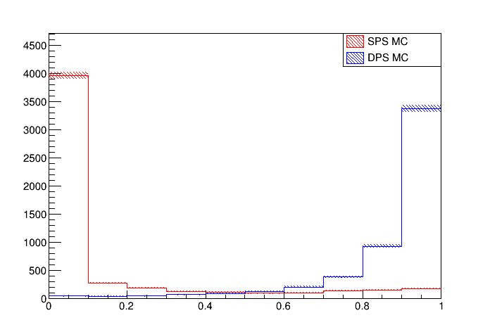
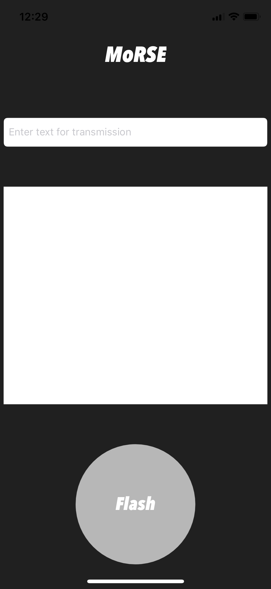

# Portfolio

## Previous projects
Here are several examples of programming tasks I have worked on, both as part of my degree and in my spare time.

### - Event mixing for particle physics in C++
  

  This code snippet is part of a program written to merge hadron collision event data in order to simulate a rare process.

### - Neural network training and testing in Python
  
  
  The above histogram displays the output of a multi-layer perceptron classifier trained to discriminate between two similar particle physics processes with an accuracy of 91%. The x-axis represents the predicted probability of a particular event being of the type referred to as "DPS MC".
  
### - Morse code application in Swift
  

  In my spare time, I have been learning the Swift programming language to test my ability to adapt and to apply my skills in new ways. The above image is the user interface of a mobile app I developed in order to translate user text input into Morse code, and to transmit this encoded message using the device's camera flash. The encoded text is displayed in the lower white text field.
    
### - 2D game programming using Spritekit in Swift
  

  Furthermore, I have used the Spritekit framework to teach myself concepts related to game development. An extract of the underlying code for a 2D mobile game I am currently developing is presented above.

## A working example
[__This link__](https://github.com/msilcs/Object_Oriented_Chess_Program) leads to a complete example of my work in the form of a command line chess application written in C++.
